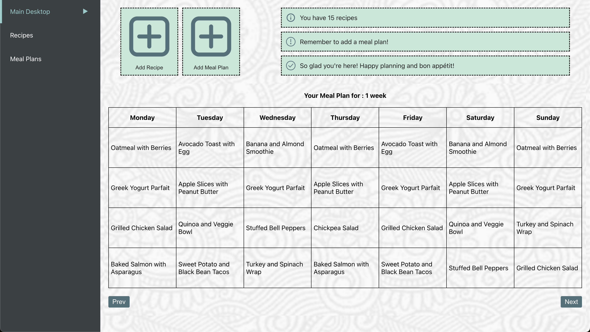
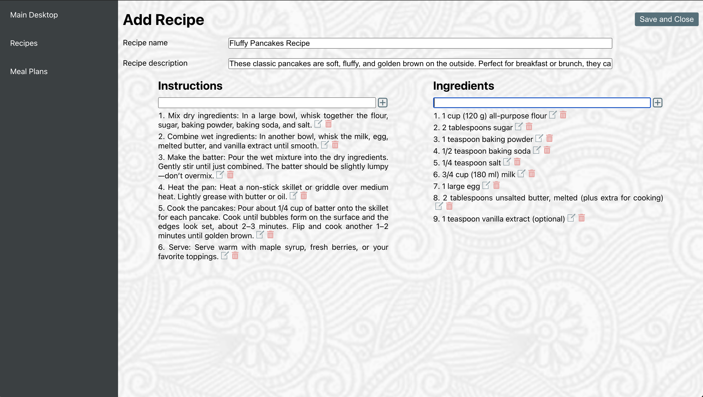
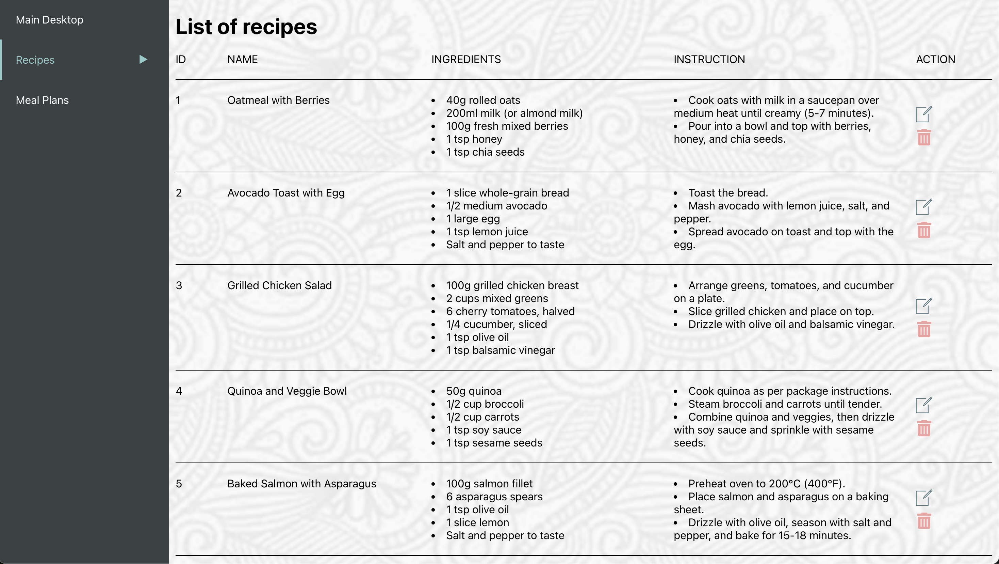
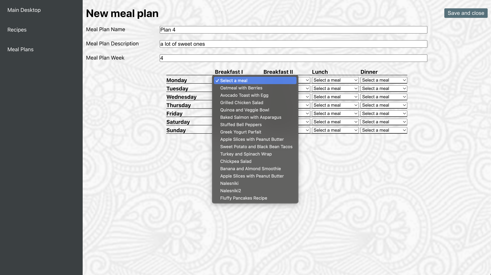
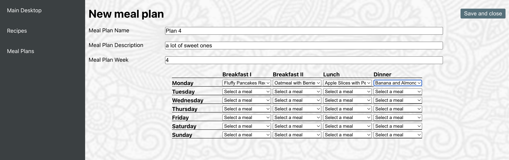
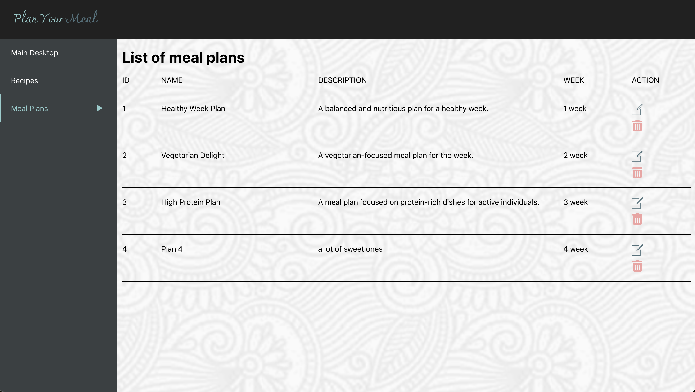

# Plan your meal

Application for creating and saving recipes, as well as building meal plans from the added recipes.

## Demo

https://quickmealplan.netlify.app/

## Tech Stack

- React (React Router, Context API, Hooks)
- SCSS
- Local Storage
- EsLint, Prettier
- RWD
- Netlify

## How to run:

- git clone https://github.com/karolina-rachuta/plan-your-meal.git
- npm install
- npm run start

## Screenshots:

- Desktop:

